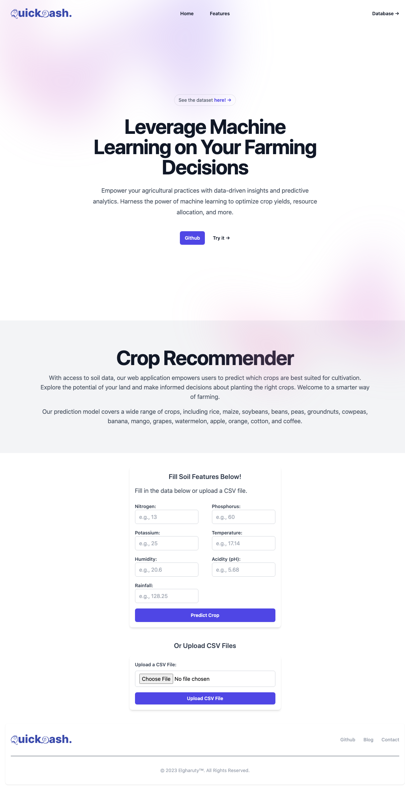

# About The Project

# QuickDash.
## Crop Recommender

QuickDash engineered to deliver highly personalized crop recommendations by leveraging a comprehensive machine learning and data analytics. This innovative tool is designed to serve farmers and agricultural enthusiasts, equipping them with invaluable insights for their crop cultivation decisions. By taking into account a multitude of factors, such as soil characteristics, climate conditions, and historical yield data, the system empowers users to make informed choices on crop selection.

Welcome to a more astute approach to agriculture!

Our prediction model boasts an extensive coverage of diverse crops, including rice, maize, soybeans, beans, peas, groundnuts, cowpeas, banana, mango, grapes, watermelon, apple, orange, cotton, and coffee. The system's capabilities extend far and wide, ensuring that a plethora of crop options are available to cater to your unique agricultural needs.

## Features

- **Data-driven Recommendations:** The system utilizes a machine learning model to analyze input data and generate crop recommendations that are tailored to the user's specific circumstances.

- **Input Parameters:** Users can input details about their location, soil type, climate conditions, and other relevant factors to receive accurate crop recommendations.

- **User-friendly Interface:** The app offers an intuitive user interface that guides users through the input process and presents recommendations in a clear and understandable format.

- **Crop Details:** (WIP) Along with recommendations, the system provides detailed information about each recommended crop, including its growth cycle, water and nutrient requirements, and potential yield.

- **Real-time Updates:**(Goals) The system can incorporate real-time weather data and other dynamic factors to ensure that recommendations remain up-to-date and relevant.

## How It Works

1. **Input Data:** Users provide information about their location (latitude and longitude), soil type, temperature, rainfall, and other relevant environmental conditions.

2. **Data Preprocessing:** The input data is preprocessed to ensure compatibility with the machine learning model. Categorical variables might be one-hot encoded, and numerical data could be standardized or normalized.

3. **Machine Learning Model:** The preprocessed data is fed into a machine learning model, which has been trained on historical crop yield data and environmental factors. The model predicts the most suitable crops for the given conditions.

4. **Crop Recommendations:** The system presents the user with a list of recommended crops, ranked by their suitability scores. Users can view detailed information about each crop.

5. **User Interaction:** Users can explore different crops, get insights into their growth requirements, and make informed decisions about crop selection.

## Getting Started

To use the Crop Recommendation System, follow these steps:

1. **Install Dependencies:** Make sure you have the necessary dependencies installed. You can find the requirements in the `requirements.txt` file.

2. **Deploy:** Launch the app using ''python app.py''

3. **Enter data:** Enter manually new data or upload CSV file. 

4. **Receive Recommendations:** The system will process your input and provide a list of recommended crops along with additional information.

5. **Explore Recommendations:**(WIP) Learn more about the recommended crops, their growth cycles, and cultivation requirements.

## Future Enhancements

- Integration with real-time weather APIs for more accurate recommendations.
- Support for multiple languages and user interfaces.
- Customizable recommendations based on user preferences and goals.

## Contributors

- [Kemal Maolana Yusuf](https://github.com/kemalmao19)
[Bloge](https://elgharuty.com)

>>>>>>> d02a234 (first)
